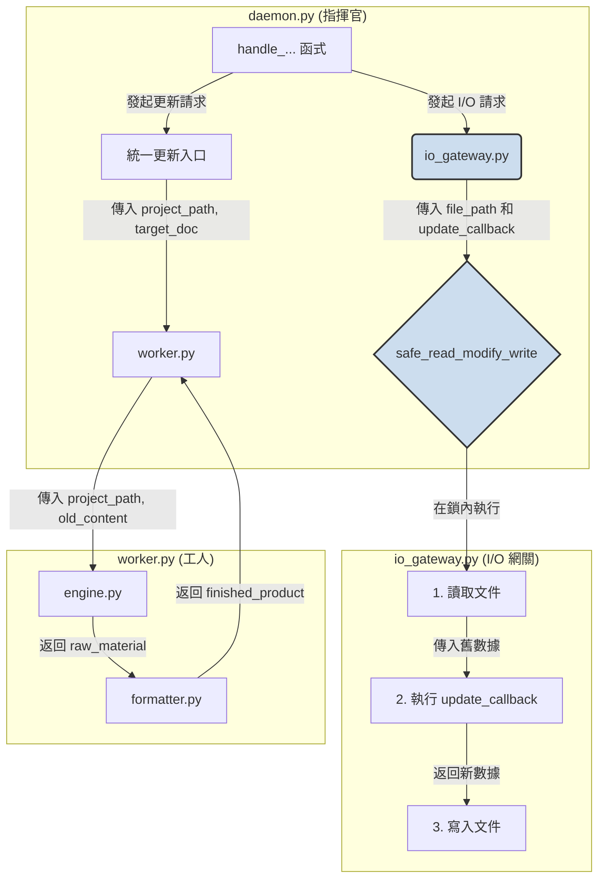

# **專案通訊協定書 v3.0 (I/O 網關版)**

**文件 ID:** `LAPLACE-SENTRY-PROTOCOL-V3.0`
**狀態:** `生效中`
**核心原則:** 本文件是專案內部所有 Python 模組間通信的**唯一真理來源**。所有內部 API、數據流和異常處理，都必須嚴格遵循此處的定義。

---

## **第一章：全局規則與定義**

### **1.1 內部 API 設計原則**

-   **異常驅動 (Exception-Driven):** 模組間的錯誤傳遞，**必須**通過拋出具體的異常（如 `ValueError`, `IOError`）來實現。成功時，函式可以返回數據或隱式返回 `None`。
-   **類型提示 (Type Hinting):** 所有函式的參數和返回值，**必須**提供清晰的類型提示，以確保程式碼的健壯性和可維護性。
-   **依賴注入 (Dependency Injection):** 核心業務邏輯函式（如 `daemon.py` 中的 `handle_...` 系列），應允許通過可選參數傳入其依賴項（如 `projects_data`），以實現可測試性。

### **1.2 數據持久化**

-   所有對文件系統的**讀寫操作**，**必須**通過 `io_gateway.py` 提供的 `safe_read_modify_write` 函式進行，以確保操作的原子性和線程安全。

---

## **第二章：C/S 通信契約 (Client-Server Contract)**

本章定義了前端 (`main.py`) 與後端 (`daemon.py` 的 `main_dispatcher`) 之間的命令行風格指令。這一層的契約保持不變，以確保向後兼容。

| 指令 (Command) | 參數 (Arguments) | 描述 | 成功響應 (stdout) |
| :--- | :--- | :--- | :--- |
| `ping` | (無) | 檢測後端服務是否可達。 | `PONG` |
| `list_projects` | (無) | 獲取所有已註冊專案的列表。 | `[ { ... }, ... ]` (JSON) |
| `add_project` | `name` `path` `output_file` | 新增一個專案。 | `OK` |
| `edit_project` | `uuid` `field` `new_value` | 修改一個現有專案。 | `OK` |
| `delete_project` | `uuid` | 刪除一個指定的專案。 | `OK` |
| `manual_update` | `uuid` | 手動觸發一次指定專案的更新。 | `OK` |
| `manual_direct` | `project_path` `target_doc` | 直接對指定路徑執行一次更新。 | `OK` |

---

## **第三章：核心工作流契約 (Core Workflow Contract)**

### **3.1 數據流示意圖 (Python-Native)**

### **3.2 `io_gateway.py` (I/O 網關)**

-   **職責：** 系統**唯一**的、**安全**的 I/O 事務處理中心。
-   **核心 API：`safe_read_modify_write(file_path, update_callback, serializer)`**
    -   **事務模型：** 該函式接收一個「回調函式」(`update_callback`)。它會在獲取文件鎖後，原子性地執行「讀取 -> 將數據傳給回調函式 -> 獲取新數據 -> 寫入」的完整事務。
    -   **副作用：** 讀取和覆寫文件系統。
    -   **異常 (`raise`):**
        -   `IOError`: 當發生任何文件操作錯誤（如權限不足、磁盤已滿）或鎖獲取失敗時拋出。
        -   `json.JSONDecodeError`: 當 `serializer` 為 `json` 且文件內容損壞時，由內部處理，並向回調函式傳遞空列表 `[]`。

### **3.3 `worker.py` (工人專家)**

-   **職責：** 調度 `engine.py` 和 `formatter.py`，完成一次完整的「內容生成」流水線。
-   **核心 API：`execute_update_workflow(project_path, target_doc, old_content)`**
    -   **數據流：** 通過**函式參數**和 `return` 值進行數據傳遞。
    -   **副作用：** 無（純數據處理，不接觸文件系統）。
    -   **返回值：** `(exit_code, result_string)` 元組。`exit_code` 為 `0` 代表成功，非 `0` 代表失敗。`result_string` 在成功時是生成的內容，失敗時是錯誤信息。

### **3.4 `engine.py` & `formatter.py` (生產線專家)**

-   **職責：** 保持不變，分別負責「生產原材料」和「包裝成品」。
-   **調用方式：** 由 `worker.py` 通過**內部函式調用**來使用，不再作為獨立的 `subprocess` 腳本。

---

## **第四章：Sentry 監控契約 (待實現)**

-   **`start_sentry <uuid>`**
    -   **描述：** 啟動哨兵監控指定專案。
    -   **行為：** 在 `daemon.py` 中創建一個長期存活的 `subprocess.Popen` 進程，運行 `inotifywait`。該進程的輸出將被 `daemon.py` 監聽，並在檢測到文件變動時，觸發對 `_run_single_update_workflow()` 的**內部調用**。
    -   **副作用：** 在系統中產生一個背景進程，並在 `daemon.py` 的內存中記錄其 PID。
-   **`stop_sentry <uuid>`**
    -   **描述：** 根據 UUID 終止該哨兵進程。
    -   **副作用：** 終止背景進程，釋放系統資源，更新 `daemon.py` 內存中的狀態。

